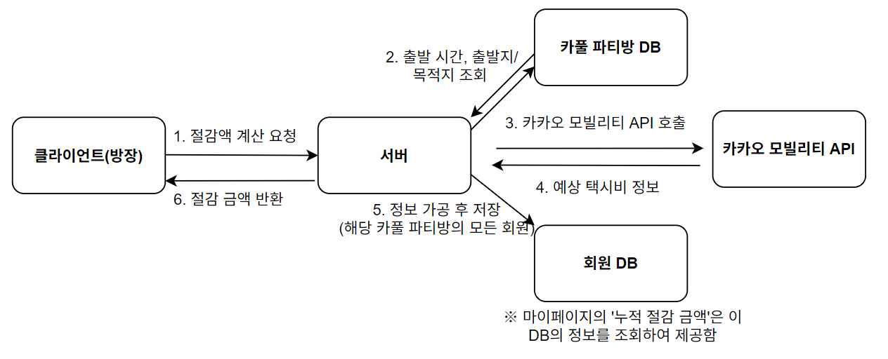
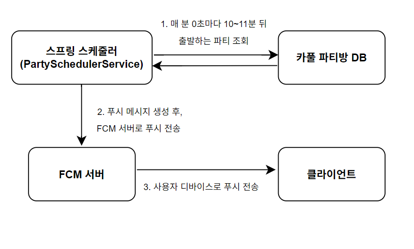
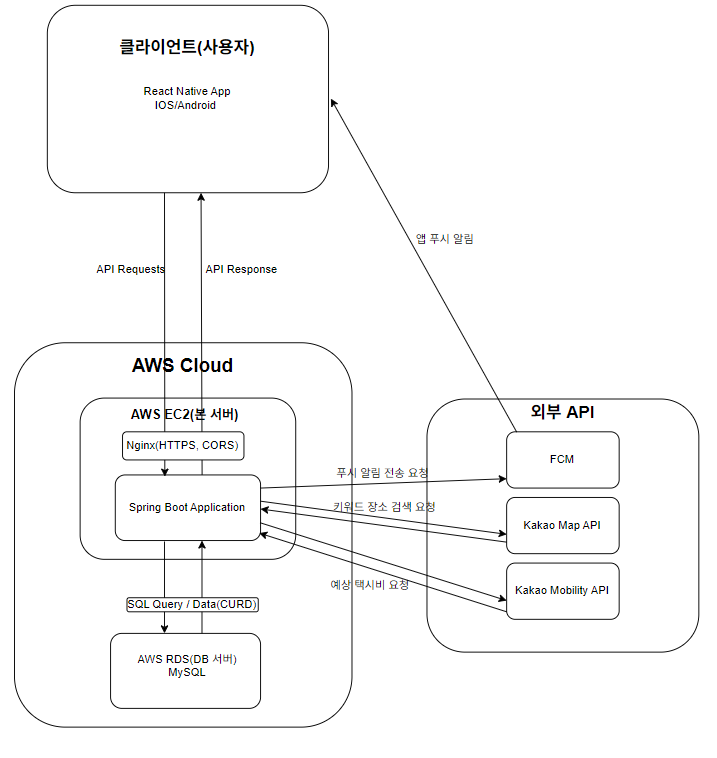
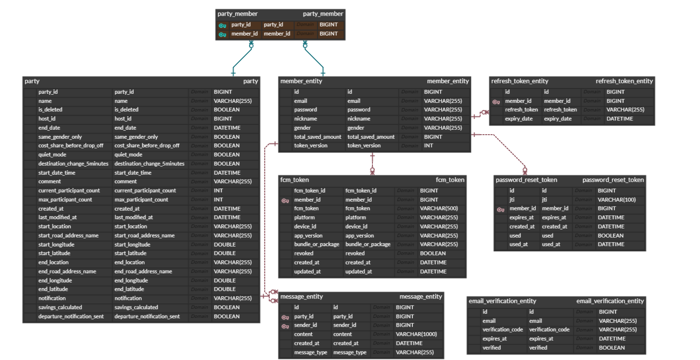
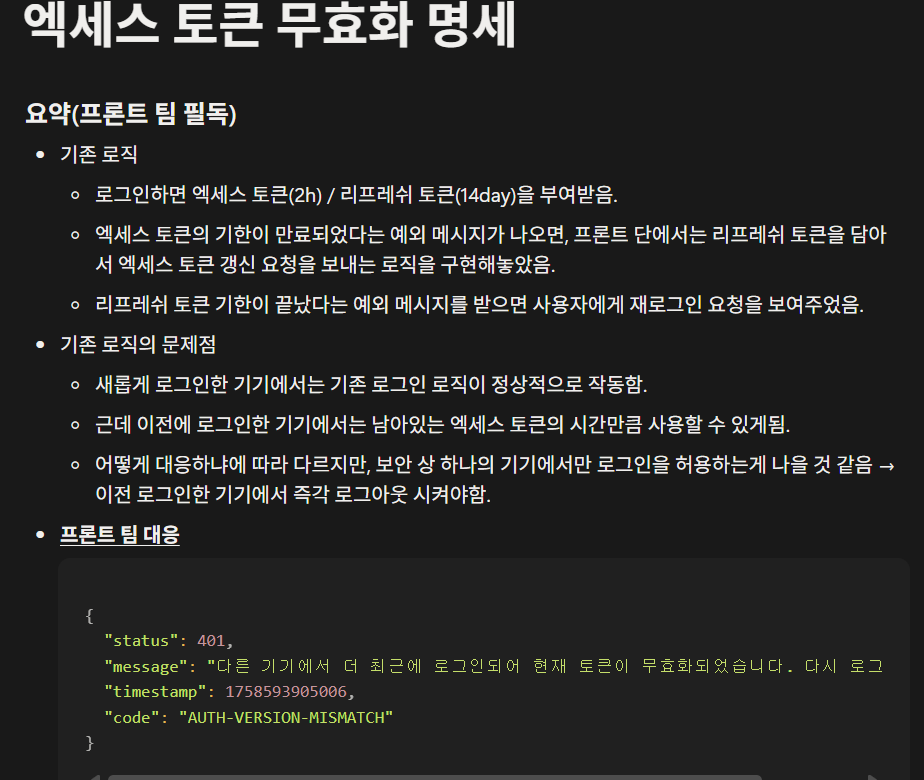
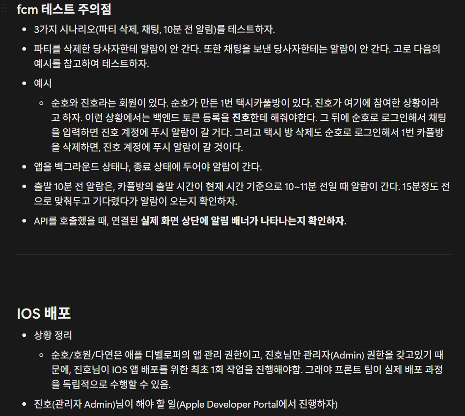

# 🚕 KNU-Carpool: 강원대학교 학생 전용 택시 카풀 앱

---

## 📖 프로젝트 소개
**KNU-Carpool**은 강원대학교 학생들만을 위한 택시 카풀 플랫폼입니다.  
학생들의 **택시비 부담을 줄이고**, **안전하고 편리한 이동 경험**을 제공하는 것을 목표로 합니다.

### 🤔 배경 및 필요성
강원대학교와 남춘천역 사이는 도보 이동이 어렵고, 버스 배차 간격이 길어 많은 학생들이 택시를 이용합니다.  
하지만 기존에는 '에브리타임 커뮤니티'나 '오픈채팅방', 그리고 '기존 카풀 앱'을 통해 인원을 모집하면서 다음과 같은 문제가 있었습니다.

- 🕒 **No-Show 문제**: 약속 불이행으로 인해 다른 사용자가 피해를 봅니다.
- ❌ **불편한 소통**: 목적지와 시간을 조율하는 과정이 번거롭습니다.
- 💬 **부적절한 언어 사용**: 비속어·부적절한 표현이 발생합니다.

### ✨ 문제 해결 방법
- ✅ **웹메일 인증**으로 강원대 재학생만 이용 가능 → 기존 카풀 앱의 '목적지·시간 조율' 번거로움 해소
- 🔔 **출발 10분 전 푸시 알림**으로 No-Show 문제 최소화
- 🧼 **비속어 필터링 시스템**으로 건전한 채팅 문화 조성
- 💰 **택시비 절약 금액 시각화**로 카풀의 장점을 명확히 보여줌

### 🗓️ 프로젝트 기간
 **[공란]**

---

## 📚 목차
1. [주요 기능](#-주요-기능)
2. [트러블슈팅](#-트러블슈팅)
3. [앱 사용 방법](#-앱-사용-방법)
4. [아키텍처](#-아키텍처)
5. [ERD](#-erd)
6. [팀 소개](#-팀-소개)
7. [배포 주소](#-배포-주소)
8. [기술 스택](#-기술-스택)
9. [백엔드 디렉토리 역할](#-백엔드-디렉토리-역할)
10. [백엔드 API 명세서](#-백엔드-api-명세)
11. [협업 전략](#-협업-전략)

---

## ✨ 주요 기능

### 💰 택시비 절감 정보 API

1. 클라이언트(방장)가 서버에 **절감액 계산 요청**을 합니다. 
2. 서버는 '**카풀 파티방 DB**'에서 해당 파티의 출발 시간, 출발지/목적지 **정보를 조회**합니다. 
3. 서버는 2번에서 조회한 정보를 바탕으로 외부 API인 **'카카오 모빌리티 API'를 호출**합니다.
4. '카카오 모빌리티 API'로부터 **예상 택시비 정보를 응답**받습니다. 
5. 서버는 응답받은 예상 택시비(4번)를 가공하여 **1인당 절감 금액을 계산**합니다. 이 정보를 **'회원 DB'**에 있는 해당 카풀 파티의 모든 파티원의 **totalSavedAmount필드에 누적 저장**합니다. 
6. 서버는 이번 카풀에서 계산된 **절감 금액**을 클라이언트(방장)에게 **반환**합니다.

※ 5번 단계에서 '회원 DB'에 절감액이 누적 저장되었기 때문에, 이후 사용자는 **마이페이지**에서 자신의 **누적 절감 금액을 조회**할 수 있습니다.

---

### 📢 출발 10분 전 푸시 알람

1. 스프링 스케줄러가 매 분 0초마다 '카풀 파티방 DB'를 조회하여, **10~11분 뒤 출발하는 파티**를 찾습니다. 
2. 스케줄러가 **조회된 파티의 멤버들을 대상**으로 푸시 메시지("곧 택시가 출발해요! 🚕")를 생성한 뒤, **FCM 서버로 푸시 전송을 요청**합니다. 
3. FCM 서버가 최종적으로 **각 멤버의 클라이언트(디바이스)로 푸시 알림을 전송**합니다.

※ 2번 단계에서 알림을 발송한 파티는 departureNotificationSent 필드값을 true로 업데이트하여, 다음 스케줄러 실행 시 **중복 발송되는 것을 방지**합니다.

---

## 🔧 트러블슈팅
> 작성 예정

---

## 📱 앱 사용 방법

**전제 조건:** 본 앱은 강원대학교 재학생만 사용 가능합니다.

### 회원가입
- 강원대학교 **웹메일 인증**을 통해 가입을 완료합니다.

### 메인 화면
- `카풀 모집하기`, `카풀 참여하기` 두 버튼이 표시됩니다.

### 카풀 모집 (방장)
1. `카풀 모집하기` 버튼 선택
2. 출발 시간, 출발지/도착지, 모집 인원 등 상세 옵션 설정
3. 새로운 카풀 파티 생성

### 카풀 참여 (파티원)
1. `카풀 참여하기` 버튼 선택
2. 원하는 시간과 장소로 정렬하여 참여할 파티 검색
3. 채팅으로 조율
4. 참여 완료

---

## 🏛️ 아키텍처

> 자세한 아키텍처 설명은 **프로젝트 Wiki**에서 확인할 수 있습니다.

---

## 🗂️ ERD

> 전체 ERD 설명은 GitHub Wiki에서 확인할 수 있습니다.

🔗 [ERD 설명 바로가기](https://github.com/capstoneDesign-taxiCarpool/team_BE/wiki/ERD)

---

## 🧑‍🤝‍🧑 팀 소개

### 🎨 Frontend
| 이름 | GitHub | 역할  |
|------|---------|-----|
| 정다연 | [@dandamdandam](https://github.com/dandamdandam) | ??? |
| 최호원 | [@BMHowon](https://github.com/BMHowon) | ??? |

### ⚙️ Backend
| 이름 | GitHub | 역할                                           |
|------|---------|----------------------------------------------|
| 권순호 | [@suno-boy](https://github.com/suno-boy) | 인증/인가, 카풀방 도메인, FCM, 웹소켓 관리, 채팅, DB 서버 관리    |
| 이진호 | [@treasure-sky](https://github.com/treasure-sky) | 회원 도메인, 이메일 전송API, FCM, 채팅, 장소 검색, EC2 서버 관리 |

---

## 🚀 배포 주소
- **Backend**: https://knu-carpool.store
- **Frontend**: [공란]

---

## 🛠️ 기술 스택

### 🖥️ Frontend
- **Language**: TypeScript
- **Framework**: React Native
- **Deployment**: [공란]

### ⚙️ Backend
- **Language**: Java
- **Framework**: Spring Boot, Spring Security, Spring WebSocket
- **Web Server**: Nginx
- **Database & ORM**: MySQL, JPA
- **Deployment**: GitHub Actions, AWS EC2, AWS RDS

---

## 📁 백엔드 디렉토리 역할

| Directory | 역할 |
|------------|------|
| `auth` | 회원가입 및 인증/인가 관리 |
| `chatting` | 채팅방 관련 API |
| `config` | 프로젝트 설정 파일 관리 |
| `email` | 이메일 전송 관련 API |
| `exception` | 전역 예외 처리 관리 |
| `fcm` | 앱 푸시 알람(FCM) 관리 |
| `map` | 장소 검색 관련 API |
| `member` | 회원 정보 관리 |
| `party` | 카풀 파티(방) 관리 |
| `profanity` | 비속어 필터링 관리 |

---

## 📑 백엔드 API 명세
> 전체 API 명세는 GitHub Wiki에서 확인할 수 있습니다.

🔗 [백엔드 API 명세 바로가기](https://github.com/capstoneDesign-taxiCarpool/team_BE/wiki/백엔드-API-명세)

---

## 🤝 협업 전략

### Branch Strategy
- 기능 개발은 `feat-기능이름` 브랜치에서 진행합니다.  
  예: `feat-login`, `feat-member`
- 개발 완료 후 `develop` 브랜치로 PR(Pull Request)을 보냅니다.
- 충분한 테스트 후, 안정적이라 판단되면 `main` 브랜치로 병합합니다.

📌 **Branch Flow:**  
`feat-* → develop → main`

### Commit Convention
| Type | Description |
|-------|--------------|
| **Feat** | 새로운 기능 추가 |
| **Fix** | 버그 수정 |
| **Docs** | 문서 작성 및 수정 |
| **Refactor** | 기능 변경 없이 로직 개선 |
| **Test** | 테스트 코드 작성 및 수정 |
| **Chore** | 빌드, 설정 등 기타 수정 사항 |

### Communication
- 주요 작업 사항 및 문제 해결 과정을 **PDF로 정리**하여 팀원과 공유합니다.  
  📌 아래 이미지는 협업 문서 일부 발췌본입니다.

#### 🔐 엑세스 토큰 무효화 명세

#### 📱 FCM 테스트 주의점 및 iOS 배포

